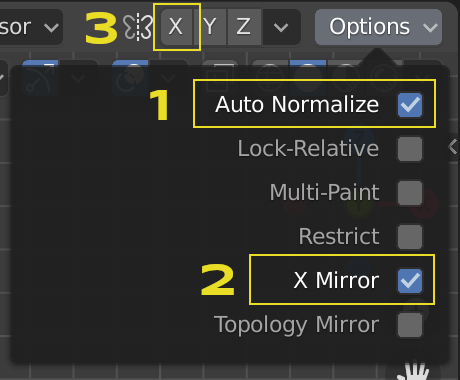

# Rigging

On this page will show you how to rig **HUMANOID** character and export to Unreal Engine.

* 3D Model : **Base mesh boy character 1 Free low-poly 3D model**

    [https://www.cgtrader.com/free-3d-models/character/man/base-mesh-boy-character-1](https://www.cgtrader.com/free-3d-models/character/man/base-mesh-boy-character-1 "Base mesh boy character 1 Free low-poly 3D model")

## Align Armature To Model

Align armature to 3d model (A-Pose or T-Pose), and check bone orientation.

!!! note ""
    <iframe width="760" height="415" src="https://www.youtube.com/embed/ySJAdWOI6zU" frameborder="0" allow="accelerometer; autoplay; encrypted-media; gyroscope; picture-in-picture" allowfullscreen></iframe>

## Skin Weight

Checking weight and paint.

!!! note ""
    <iframe width="760" height="415" src="https://www.youtube.com/embed/q3mpFQaq24Y" frameborder="0" allow="accelerometer; autoplay; encrypted-media; gyroscope; picture-in-picture" allowfullscreen></iframe>

!!! info
    Select the armature and then select the mesh, enter to **Weight Paint** mode.
    
    You can show the armature with ++ctrl+z++ and select the bone with ++ctrl+"click"++.

    Also you can tweak bone (rotation with ++r++), give you more visualization how defrom goes

!!! info
    

    1. **Auto Normalize**

        Ensures that all deforming vertex groups add up to one while painting. When this option is turned off, then all weights of a vertex can have any value between 0 and 1. However, when vertex groups are used as deform groups for character animation then Blender always interprets the weight values relative to each other. That is, Blender always does a normalization over all deform bones. Hence in practice it is not necessary to maintain a strict normalization and further normalizing weights should not affect animation at all.

        This option works most intuitively when used to maintain normalization while painting on top of weights that are already normalized with another tool.

        [https://docs.blender.org/manual/en/latest/sculpt_paint/weight_paint/tool_settings/options.html#options](https://docs.blender.org/manual/en/latest/sculpt_paint/weight_paint/tool_settings/options.html#options "Options")

    2. **X Mirror**

        Use the X Mirror option for mirrored painting on groups that have symmetrical names, like with extension “.R”/ “.L” or “_R” / “_L”. If a group has no mirrored counterpart, it will paint symmetrically on the active group itself. You can read more about the naming convention in [Editing Armatures: Naming conventions](https://docs.blender.org/manual/en/latest/animation/armatures/bones/editing/naming.html#naming-conventions "Editing Armatures: Naming conventions"). The convention for armatures/bones apply here as well.

        [https://docs.blender.org/manual/en/latest/sculpt_paint/weight_paint/tool_settings/options.html#options](https://docs.blender.org/manual/en/latest/sculpt_paint/weight_paint/tool_settings/options.html#options "Options")

    3. **Symmetry X Axis (Optional)**

        Mirror the brush strokes across the selected local axes, very useful if you painting on non symmetrical bones.

        [https://docs.blender.org/manual/en/latest/sculpt_paint/brush/symmetry.html](https://docs.blender.org/manual/en/latest/sculpt_paint/brush/symmetry.html "Symmetry")

## Set To A-Pose

Set pose to A-Pose (Unreal Engine Mannequin).

!!! note ""
    <iframe width="760" height="415" src="https://www.youtube.com/embed/lw6ukV3bWSM" frameborder="0" allow="accelerometer; autoplay; encrypted-media; gyroscope; picture-in-picture" allowfullscreen></iframe>

## Apply Pose

Apply pose for the rest of pose (Default pose), the purpose is to make A-Pose as default pose for great result sharing animation with different proportions.

[https://docs.unrealengine.com/en-US/Engine/Animation/AnimationRetargeting/index.html](https://docs.unrealengine.com/en-US/Engine/Animation/AnimationRetargeting/index.html "Animation Retargeting")

!!! note ""
    <iframe width="760" height="415" src="https://www.youtube.com/embed/jG_DwDKXc24" frameborder="0" allow="accelerometer; autoplay; encrypted-media; gyroscope; picture-in-picture" allowfullscreen></iframe>

## Export To Unreal Engine

Export to Unreal Engine for preview how it will be in Unreal Engine.

!!! note ""
    <iframe width="760" height="415" src="https://www.youtube.com/embed/L4zsy8o1fpw" frameborder="0" allow="accelerometer; autoplay; encrypted-media; gyroscope; picture-in-picture" allowfullscreen></iframe>

## Generate Rig

If anything seem good you can generate rig for future animation in Blender.

!!! note ""
    <iframe width="760" height="415" src="https://www.youtube.com/embed/3KJL9x20e3o" frameborder="0" allow="accelerometer; autoplay; encrypted-media; gyroscope; picture-in-picture" allowfullscreen></iframe>

## Control Rig

Control Rig panel in object panel.

!!! note ""
    <iframe width="760" height="415" src="https://www.youtube.com/embed/UtvYICbIwDs" frameborder="0" allow="accelerometer; autoplay; encrypted-media; gyroscope; picture-in-picture" allowfullscreen></iframe>